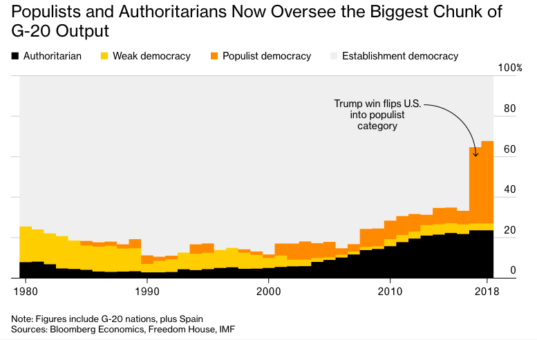

```{r setup, include=FALSE}
knitr::opts_chunk$set(echo = TRUE)
```

## This is my critical analysis of a plot I found on the web.

#### This plot was originally posted by Bloomberg, which is a news outlet I read quite regularly. I chose Bloomberg because I find their plots to be quite creative, informative and very different from the other news websites.





#### So, this is the plot. Some problems emerge quickly in the interpretation of the plot though. Since the plot has no labels for the X and Y axis, one must assume that information based on the title. I assumed that the Y axis is the percentage of the total G20 Economic Output and the X axis is the year. But the graph has another information plotted in it, and that is the "Political System" that rules the government of the nations on the G20.

#### What the plot is trying to tell us is quite clear: Autoritarians and populists now oversee most of the G20 global output. But another question arises from that, which is: "how do you define the type and status of a political system?", or "who defines the type of a political system?". How do you come to the conclusion that a nation has a "weak democracy"? You can have the opinion that the U.S Government is not run by a Populist, or say that Venezuela isn't an autoritharian government.

#### For this plot to be useful, in my opinion, the methods that you used to gather and classify the data must be really clear. 

#### Other than that, I think the design of the plot is really good, and it really carries the message that the newspaper is trying to convey. Some color choices might have been on pourpose, like the white color for the democratic governments since those were not the focus of the message, and that might be a point for discussion, but that's just fine for me.